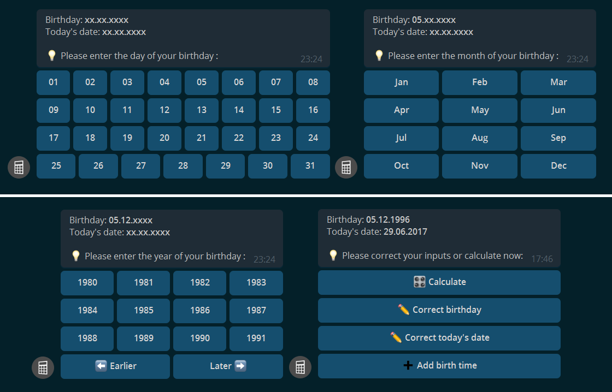

# AgeCalculatorBot

### Telegram: [@AgeCalculatorBot](https://t.me/AgeCalculatorBot)

#### Know more about your birthday!
#### This Telegram bot calculates interesting data for your birthday.

## Contents
[Functions](#functions)  
[Installation](#installation)  
[Screenshots](#screenshots)  
[Special thanks](#special-thanks)  
[License](#license)  

## Functions
* Calculates time since birth and time until next birthday
* Calculates age in years, months, days, hours, minutes and seconds
* Updating this total values interactively for 15 seconds
* Calculates the weekday of your birth and the weekdays for the next ten birthdays
* Calculates special events e.g. the date when you get 1,000,000 hours old
* Simple interface for inserting date
* All inputs throug inline buttons
* Choose your lanugage (at the moment english, german and azerbaijani available)

## Installation

#### Clone Repository
```bash
git clone https://github.com/Andre0512/AgeCalculatorBot.git
cd AgeCalculatorBot/
```
#### Create virtual environment (optional)
```bash
python3 -m venv venv
source venv/bin/activate
```
#### Install Telegram requirements
```bash
pip install -r requirements.txt
```
#### Enter required data into `config.yml`
```bash
cp config.yml.default config.yml
nano config.yml
```
For this step, you have to register a Telegram bot by the Telegram [@BotFahter](https://t.me/botfather).

You can see your Telegram ID by using the [@userinfobot](https://telegram.me/userinfobot).

#### Start the bot
```
python3 AgeCalculatorBot.py &
```

## Screenshots

### Show results
 

### Input dialogs


## Special thanks

#### For translating
* Azerbaijani: [@Sazi_z](https://t.me/sazi_z) 

## License
This project stands under GNU General Public License.

Contributions to are welcomed. Tell me if you have a good idea for the project or do a pull request.
